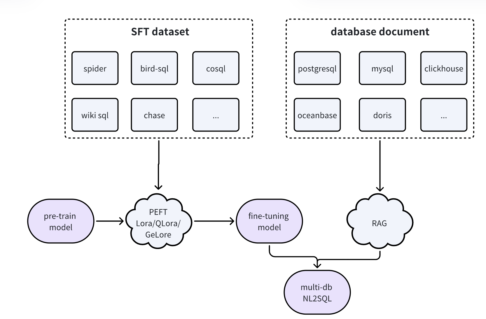

# Multi-DB NL2SQL

Multi-DB NL2SQL项目旨在通过先进的自然语言处理技术，将用户的自然语言问题自动转换为结构化查询语言（SQL），以便在多种数据库中进行查询。项目的核心特点和实现流程包括：

* 基座模型：项目采用上海AI Lab提供的书生浦语大模型[InternLM](https://github.com/InternLM/InternLM)。书生浦语大模型以其卓越的自然语言理解和生成能力，为NL2SQL任务提供了坚实的基础。
* 微调（SFT）：我们使用LoRA（Low-Rank Adaptation）或QLoRA等参数高效微调技术（PEFT），在Spider等NL2SQL数据集上对书生浦语大模型进行了监督微调（SFT）。这些数据集涵盖了丰富多样的自然语言问题及其对应的SQL查询，能够显著提升模型在NL2SQL任务中的表现。
* 推理过程：在推理过程中，我们结合了检索增强生成（RAG）技术。根据用户提出的问题，动态召回相关数据库的文档，确保模型能够适配不同数据库的结构和内容，从而生成准确且高效的SQL查询。
* 精确适配不同数据库：与其他项目相比，Multi-DB NL2SQL项目在适配不同数据库方面表现更为出色。模型在处理不同数据库类型的SQL更准确和灵活，确保用户提出的自然语言问题能够精确转换为适合特定数据库的SQL查询。

# 参加项目

[书生大模型实战营](https://github.com/InternLM/Tutorial)
